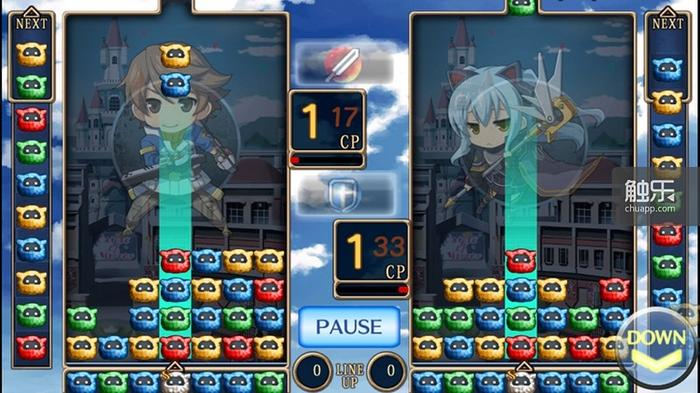
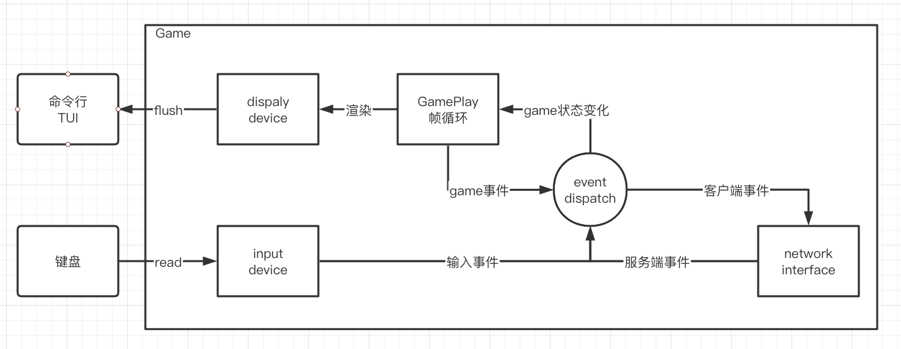

# Pom! 一个mini网络戏的从0到1完整过程

这是一个类似俄罗斯方块的简单有趣的游戏，麻雀虽小，五脏俱全，这个仓库将带你入门网络游戏开发！
不使用任何游戏引擎，以GamePlay为核心，演示如何从0开始一步一步搭建**游戏元素**以及**最小的游戏引擎**框架。

## 游戏规则

**基本元素**

在7*12的**沙盒**中，有4种**波母**(不同颜色区分)，每回合从顶部不断下落波母，落到沙盒中后，会不断堆积起来。每次下落紧挨的两个。

**基本规则**

- 玩家可以控制下落中的波母，**左右移动**到任意一列，或者**上下互换**两个波母的位置，直到接触到下方波母之前，可以不断执行这几个操作
- 沙盘中堆积的波母，只要有3个或以上相同的波母挨在一起，就会自动**消除**，消除后空缺位置上方的波母自动下落，如果此时满足可消除状态，则重新执行此规则

**扩展规则**

以上基本规则已经能构成最小GamePlay，为了增加趣味性，增加以下规则

- 每隔固定一段时间，沙盒从下方插入一行新的波母，之前的波母则自动往上挪一行
- 有第5种波母(s波母)，这种波母不会从上方降落，会随机生成到沙盒中。s波母周围只要发生波母消除，则s波母也自动消除，玩家的**CP值**+100
- 每个玩家有2个**技能**，skill1消耗100CP，消除自己沙盒中最下面的一行波母，skill2消耗100CP给其他某个玩家底部增加一行波母，技能只消耗CP，使用次数不限

**胜利条件**

沙盒中最先触顶的玩家判负，场上剩下的最后一名玩家胜利。

## 游戏框架分解

整个游戏框架分成**GamePlay**与**外设**两大部分，重点聚焦在GamePlay上，外设部分不是重点，一般情况下游戏引擎已经封装的很好，
这里就用相关的库来实现交互，图像用终端字符界面显示，最大程度减少渲染相关的代码。

为了移植方便，不定义图形图像相关的细节，只定义Game的渲染对象状态，以后可以移植到别的形式的图形界面里。

## 章节

代码会包含以下各个模块，文档会按照开发的顺序进行功能拆解，中途会穿插一些设计模式、ECS或其他关联的知识。

- 客户端GamePlay
  - 沙盒
  - 波母
  - 玩家
  - 帧循环
  - 事件循环
  - 动画
  - 渲染
- 交互系统
  - 输入设备
    - 键盘
  - 输出设备
    - 渲染设备
- 服务端
  - 网络通信
  - 同步
  - 事件循环
